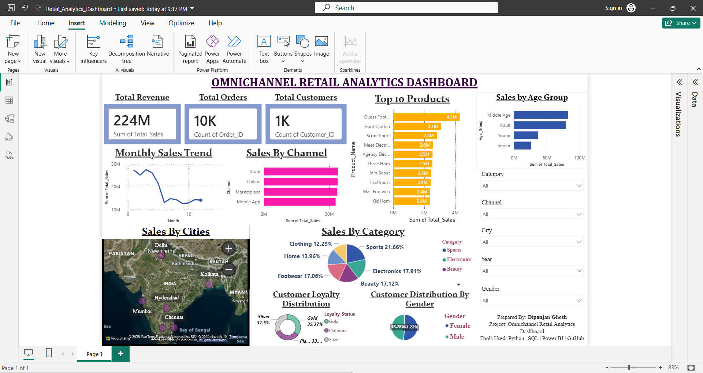

# Omnichannel Retail Analytics Dashboard

## Project Overview

The Omnichannel Retail Analytics Dashboard is an end-to-end data analytics project designed to help retail businesses monitor sales performance, customer behavior, product trends, and channel effectiveness across multiple sales platforms.

The project integrates data cleaning, SQL-based analysis, and interactive Power BI visualizations to provide actionable business insights for decision-makers.

---

## Business Problem

Retail businesses often operate through multiple channels such as physical stores, online platforms, marketplaces, and mobile applications. Managing and analyzing data from these channels separately can lead to inefficient decision-making.

This project aims to:

* Consolidate retail sales data into a unified analytical framework.
* Identify sales trends and top-performing products.
* Analyze customer demographics and purchasing behavior.
* Evaluate channel performance.
* Support data-driven business decisions through interactive dashboards.

---

## Objectives

* Calculate key retail KPIs.
* Analyze monthly sales trends.
* Identify top-performing products and categories.
* Understand customer demographics.
* Compare sales performance across channels and cities.
* Generate actionable business recommendations.

---

## Tools & Technologies Used

| Tool         | Purpose                        |
| ------------ | ------------------------------ |
| Python       | Data Cleaning & Transformation |
| Pandas       | Data Manipulation              |
| SQL          | Data Querying & Analysis       |
| Power BI     | Dashboard Development          |
| Git & GitHub | Version Control                |
| Excel/CSV    | Data Source                    |

---

## Dataset Description

The dataset contains retail transaction information including:

* Order ID
* Customer ID
* Product Name
* Product Category
* Sales Amount
* Sales Channel
* Customer Demographics
* City Information
* Order Date

The data was cleaned and transformed using Python before performing SQL analysis and visualization in Power BI.

---

## Data Cleaning & Preparation

The following preprocessing steps were performed:

* Removed duplicate records.
* Handled missing values.
* Standardized data formats.
* Converted date columns into usable formats.
* Created additional analytical fields.
* Validated data consistency.

---

## SQL Analysis Performed

Key SQL queries were written to calculate:

* Total Revenue
* Total Orders
* Total Customers
* Sales by Category
* Sales by Channel
* Top Products
* City-wise Sales Performance
* Customer Segment Analysis

---

## Dashboard Features

### KPI Cards

* Total Revenue
* Total Orders
* Total Customers

### Sales Analysis

* Monthly Sales Trend
* Sales by Channel
* Sales by Category
* Sales by Age Group

### Product Analysis

* Top 10 Products

### Customer Analysis

* Customer Loyalty Distribution
* Customer Distribution by Gender

### Geographic Analysis

* Sales by Cities Map

### Interactive Filters

* Category
* Channel
* City
* Year
* Gender

---

## Dashboard Screenshot

---

# Key Business Insights

### Revenue Performance

* The business generated a total revenue of **224M**.
* Over **10K orders** were processed from approximately **1K customers**.

### Category Performance

* **Sports** emerged as the highest-performing category, contributing approximately **21.66%** of total sales.
* Electronics and Footwear also contributed significantly to overall revenue.

### Customer Insights

* **Middle Age customers** generated the highest sales revenue.
* Revenue contribution was relatively balanced across genders.

### Channel Performance

* Store and Online channels were the strongest contributors to revenue.
* Marketplace and Mobile App channels also demonstrated consistent sales performance.

### Product Insights

* The highest-selling product generated approximately **4.3M** in revenue.
* Multiple products contributed over **2M** in sales, indicating a diversified product portfolio.

### Geographic Insights

* Major metropolitan cities contributed significantly to overall sales.
* Regional demand patterns indicate opportunities for targeted expansion.

---

# Strategic Recommendations

### 1. Focus on High-Performing Categories

Increase inventory availability and marketing investment for Sports and Electronics products to maximize revenue growth.

### 2. Target Middle-Age Customers

Develop personalized campaigns and loyalty programs targeting the Middle Age segment, which contributes the highest revenue.

### 3. Strengthen Omnichannel Strategy

Continue investing in Store and Online channels while improving customer experience across all sales platforms.

### 4. Optimize Inventory Planning

Use product-level sales insights to maintain optimal stock levels and reduce inventory shortages.

### 5. Regional Expansion Strategy

Leverage city-level sales analysis to identify high-potential markets and improve regional sales performance.

### 6. Improve Customer Retention

Enhance loyalty programs and targeted promotions to increase repeat purchases and long-term customer value.

---

# Business Impact

The dashboard enables retail managers and business stakeholders to:

* Monitor sales performance in real time.
* Identify revenue opportunities.
* Understand customer purchasing behavior.
* Optimize inventory management.
* Improve strategic decision-making.

---

## Conclusion

The Omnichannel Retail Analytics Dashboard successfully integrates retail sales, customer, product, and geographic data into a single business intelligence solution.

Through Python-based data preparation, SQL-driven analysis, and Power BI visualizations, the project provides valuable insights that support revenue optimization, inventory planning, and customer-centric decision-making.

This project demonstrates practical skills in Data Analytics, Business Intelligence, SQL, Python, Data Visualization, and GitHub-based project management.

---

## Author

**Dipanjan Ghosh**

### Tools Used

Python | Pandas | SQL | Power BI | Git | GitHub

### Project Type

Data Analytics Internship Project – Omnichannel Retail Analytics Dashboard
